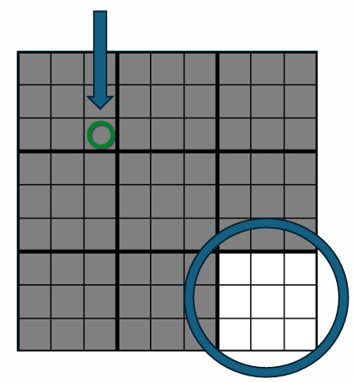
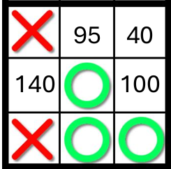

# Tic-Tac-Toe 2 (Jogo da Velha 2)

## 🎮 Sobre o Jogo

O **Tic-Tac-Toe 2** é uma versão expandida e estratégica do tradicional Jogo da Velha. Enquanto as regras básicas permanecem as mesmas — formar uma linha, coluna ou diagonal com seus marcadores — o jogo acontece em um tabuleiro maior, composto por 9 tabuleiros menores, o que exige mais estratégia e pensamento tático.

## ⚙️ Regras do Jogo

### 🥅 Objetivo

O objetivo do **Jogo da Velha 2** é formar uma linha, coluna ou diagonal em um tabuleiro maior 3x3, mas com a adição de um novo nível de estratégia. Para conquistar um espaço no tabuleiro principal, você precisa vencer em um dos tabuleiros menores dentro dele.

### 🔲 Estrutura do Jogo

O jogo acontece em um tabuleiro 3x3, onde cada quadrado contém um **Jogo da Velha menor** (um tabuleiro 3x3 dentro de cada quadrado). O jogador precisa vencer em um dos tabuleiros menores para conseguir fazer a jogada no tabuleiro principal.

### 🎮 Regras de Movimento

- O primeiro jogador pode escolher qualquer tabuleiro menor para fazer o primeiro movimento.
- O local onde o jogador marca dentro de um tabuleiro menor define o próximo tabuleiro menor onde o adversário deve jogar.
  
**Exemplo**:  
Se o primeiro jogador marcar o canto inferior esquerdo de um tabuleiro menor, o adversário deve fazer o movimento no tabuleiro menor que ocupa a mesma posição no tabuleiro principal.

- Se o tabuleiro correspondente já estiver vencido, o jogador pode escolher qualquer outro tabuleiro ainda em jogo.
  
### 🏆 Vitória e Progressão

- Para conquistar um espaço no tabuleiro principal, um jogador deve vencer o respectivo tabuleiro menor formando uma linha, coluna ou diagonal.
- O jogo continua até que um dos jogadores complete uma linha, coluna ou diagonal no tabuleiro principal, vencendo a partida.

### 🚫 Finalização de Tabuleiros Menores

- Quando um tabuleiro menor é vencido, ele é marcado com o símbolo do vencedor e não pode mais ser jogado.
- Se um jogador for direcionado para um tabuleiro já concluído, ele pode escolher qualquer tabuleiro ainda disponível.
- Se um tabuleiro menor terminar em **empate** (quando todas as 9 posições forem preenchidas e não houver vencedor), ele será zerado e poderá ser jogado novamente.

## 🤖 Como Funciona a IA

A IA utiliza um sistema de pontuação e análise recursiva para tomar decisões:

### Sistema de Pontuação
- Cada movimento possível é avaliado e recebe uma pontuação
- A pontuação final considera:
  - A pontuação da posição no tabuleiro menor atual (que é a somatória de todas as linhas, colunas e diagonais que aquela posição está)
  - A importância estratégica do tabuleiro menor no contexto do tabuleiro maior
- Exemplo de matriz de pontuação:

|    | O   |   | X  |
|---|---|---|---|
| O    | 100 | 50 | -5    |
|    | 50  | 10 | -5    |
| X    | -5  | -5  | 90    |

### Níveis de Dificuldade

#### Fácil
- Analisa apenas os movimentos imediatos que pode fazer

#### Médio em Diante
- Além de avaliar seus próprios movimentos, considera as possíveis respostas do adversário
- Implementa uma análise um passo à frente, subtraindo a possível maior pontuação de seu adversário da pontuação de seu movimento, para averiguar qual realmente seria o melhor movimento.
  - Quanto maior a dificuldade, maior a quantidade de rodadas a frente que são visualizadas. Atualmente: Médio = 1, Difícil = 3

#### Custom

- O usuário pode colocar a recursividade que desejar

## Comparativo de Desempenho
O documento mostra um comparativo entre as diferentes IAs:

| Opponent \ IA | Aleatória | Fácil | Médio | Difícil |
|---------------|-----------|-------|-------|---------|
| Aleatória     | 43/14/43  | 6/0/94 | 0/1/99 | 0/0/100 |
| Fácil         | 94/0/6    | 47/7/46 | 0/2/98 | 0/0/100 |
| Médio         | 99/1/0    | 98/2/0 | 32/24/44 | 1/37/62 |
| Difícil       | 100/0/0   | 100/0/0 | 62/37/1 | 38/28/34 |

(O formato é Vitórias/Empates/Derrotas)

## Problemas encontrados

Com a tabela de pontuação atual, apesar de uma IA acima ficar muito superior as demais, foi encontrado situações onde a IA não faz o movimento mais óbvio mesmo quando considerado um único jogo. Um exemplo pode ser demonstrado na imagem abaixo. Onde o circulo preferiria interromper o movimento do X do que finalizar a sua coluna central (Lembre-se que no jogo da velha 2 é possível ter situações onde a quantidade de O e X não são balanceados e por isso a imagem abaixo é possível). 

## Melhorias Planejadas
1. Aprofundar a recursividade para aumentar a dificuldade
2. Modificar o sistema de pontuação para melhorar a situação atual entre níveis
3. Adicionar pesos diferentes para movimentos no tabuleiro maior
4. Valorizar mais o movimento inicial em comparação com a resposta do adversário

## 📱 Links

- **Jogar Online**: [Clique aqui para jogar](https://ppinheiro.itch.io/tic-tac-toe-2)

